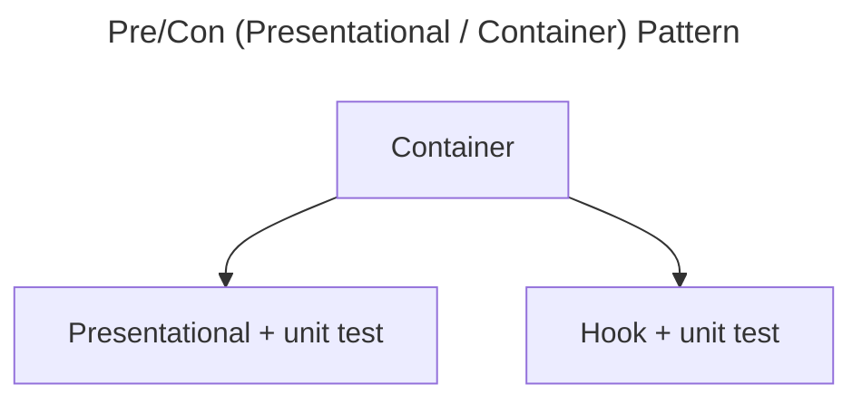
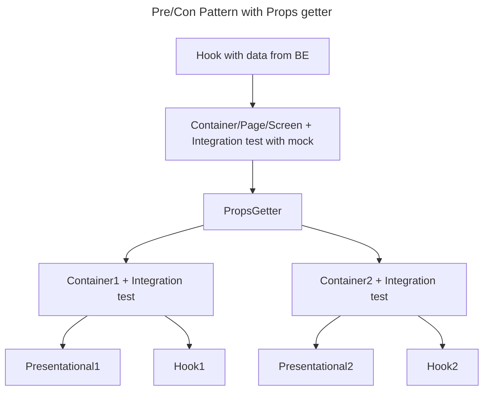

```mermaid
---
title: Pre/Con (Presentational / Container) Pattern
---
flowchart TD
    Container[Container]
    Presentational[Presentational + unit test]
    Hook[Hook + unit test]
    Container-->Presentational
    Container-->Hook

```

```
Presentational: Pure UI Component
Hook: state, effect, ref, etc...
Container: Integration between Presentational and Hook
```


```mermaid
---
title: Pre/Con Pattern with Props getter
---
flowchart TD
    ContainerPage[Container/Page/Screen + Integration test with mock]
    ContainerPage-->PropsGetter

    HookData[Hook with data from BE]
    HookData-->ContainerPage

    PropsGetter[PropsGetter]
    PropsGetter-->Container1
    PropsGetter-->Container2

    Container1[Container1 + Integration test]
    Presentational1[Presentational1]
    Hook1[Hook1]
    Container1-->Presentational1
    Container1-->Hook1

    Container2[Container2 + Integration test]
    Presentational2[Presentational2]
    Hook2[Hook2]
    Container2-->Presentational2
    Container2-->Hook2
```
